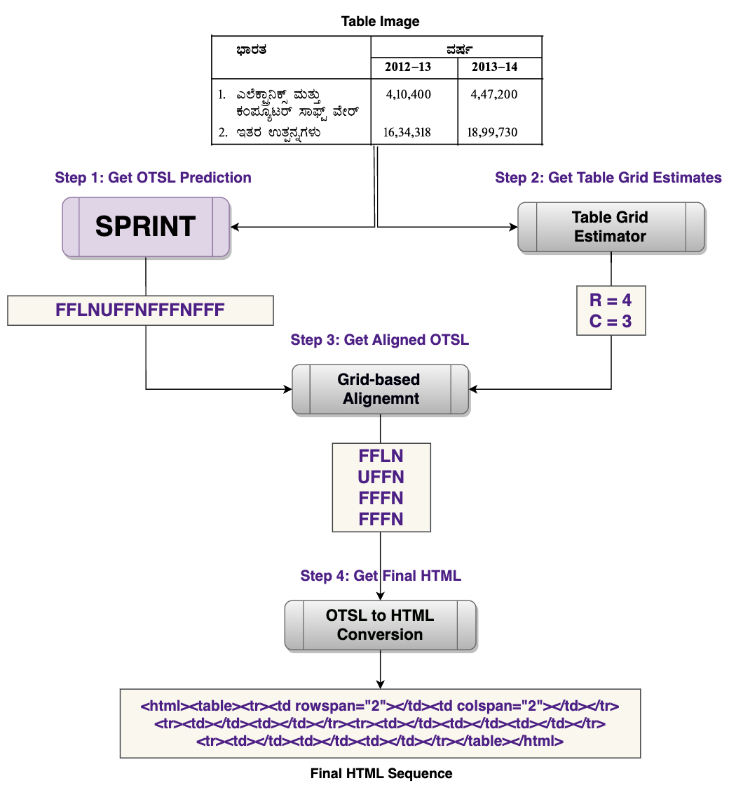
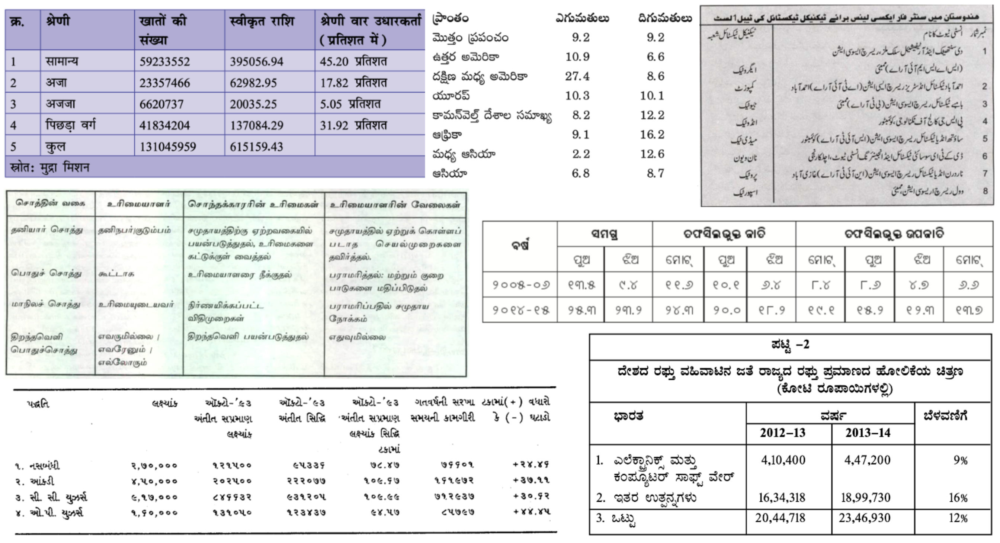
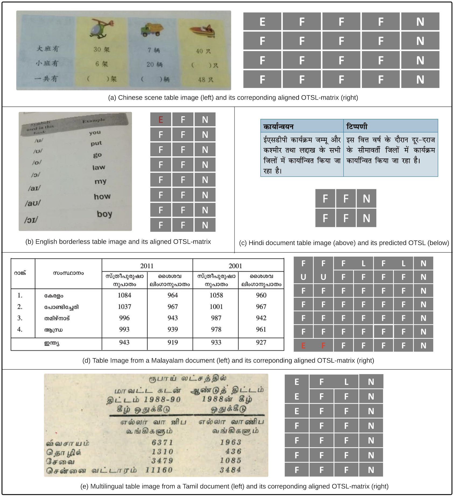

# SPRINT
SPRINT: Script-agnostic Structure Recognition in Tables

## Abstract

Table Structure Recognition (TSR) is vital for various downstream tasks like information retrieval, table reconstruction, and document understanding. While most state-of-the-art (SOTA) research predominantly focuses on TSR in English documents, the need for similar capabilities in other languages is evident, considering the global diversity of data. Moreover, creating substantial labeled data in non-English languages and training these SOTA models from scratch is costly and time-consuming. We propose TSR as a language-agnostic cell arrangement prediction and introduce **SPRINT** — Script-agnostic Structure Recognition in Tables. **SPRINT** uses recently introduced Optimized Table Structure Language (OTSL) sequences to predict table structures. We show that when coupled with a pretrained table grid estimator, **SPRINT** can improve the overall tree edit distance-based similarity structure (TEDS-S) scores of tables even for non-English documents. We experimentally evaluate our performance across benchmark TSR datasets including PubTabNet, FinTabNet, and PubTables-1M. Our findings reveal that **SPRINT** not only matches SOTA models in performance on standard datasets but also demonstrates lower latency. Additionally, **SPRINT** excels in accurately identifying table structures in non-English documents, surpassing current leading models by showing an absolute average increase of 11.12\%. To encourage further research, we release our code and  Multilingual Scanned and Scene Table Structure Recognition Dataset, (**MUSTARD**) labeled with OTSL sequences for $1428$ tables in thirteen languages encompassing several scripts. Additionally, we also present an algorithm for converting valid OTSL sequences into a widely used HTML-based table representation.

# Getting Started

## Installation and Implementation

# Methodology

## SPRINT

# Datasets

The MUSTARD Dataset could be downloaded from this link - [dataset link](https://iitbacin-my.sharepoint.com/:f:/g/personal/22m2119_iitb_ac_in/EgAjCRHvsP1FuSWvTLnpshEBtEINXfwgxA2JgAbj_ZAxVw?e=lWHB1n)

## MUSTARD Dataset

MUSTARD dataset has been curated from various magazines and  contains both printed, scanned and scene-text tables

# Results

| Dataset        | TableFormer + OTSL | TableFormer + OTSL | TableFormer + OTSL | Ours   | Ours   | Ours   |
|----------------|--------------------|--------------------|--------------------|--------|--------|--------|
|                | TEDS-S Simple      | TEDS-S Complex     | TEDS-S Overall     | TEDS-S Simple | TEDS-S Complex | TEDS-S Overall |
| PubTabNet      | 96.50              | 93.40              | 95.50              | **98.20**     | **96.24**      | **97.55**      |
| FinTabNet      | 95.50              | 96.10              | 95.90              | **98.36**     | **97.99**      | **98.17**      |
| PubTables-1M   | 98.70              | 96.40              | **97.70**          | **98.92**     | **96.54**      | **97.68**      |

| Modality          | Language | TEDS-S Simple | TEDS-S Complex | TEDS-S Overall | TEDS-S Simple | TEDS-S Complex | TEDS-S Overall |
|-------------------|----------|---------------|----------------|----------------|---------------|----------------|----------------|
|                   |          | MTL-TabNet    | MTL-TabNet     | MTL-TabNet     | Ours          | Ours           | Ours           |
| Document Tables   | Assamese | 79.39         | 73.40          | 76.54          | **88.09**     | **88.74**      | **88.40**      |
| (Printed and      | Bengali  | 71.68         | 60.02          | 61.42          | **77.24**     | **78.52**      | **78.36**      |
| Scanned)          | Gujarati | 85.12         | 76.72          | 79.63          | **87.79**     | **81.34**      | **83.58**      |
|                   | Hindi    | 73.80         | 76.60          | 75.04          | **85.68**     | **88.22**      | **86.81**      |
|                   | Kannada  | 68.82         | 66.73          | 67.20          | **71.84**     | **79.02**      | **77.34**      |
|                   | Malayalam| 82.57         | 79.34          | 81.07          | **86.41**     | **85.13**      | **85.81**      |
|                   | Oriya    | 85.28         | 78.03          | 82.84          | **91.55**     | **85.20**      | **89.41**      |
|                   | Punjabi  | 65.08         | 48.63          | 51.54          | **86.91**     | **79.65**      | **80.93**      |
|                   | Tamil    | 81.96         | 71.88          | 77.83          | **94.91**     | **85.87**      | **91.21**      |
|                   | Telugu   | 85.07         | 79.28          | 82.17          | **93.70**     | **86.00**      | **89.85**      |
|                   | Urdu     | 70.94         | 69.74          | 70.03          | **81.39**     | **75.38**      | **76.86**      |
|                   | Chinese  | 92.43         | 81.58          | 86.15          | **98.11**     | **86.00**      | **91.10**      |
| Scene Tables      | English  | 76.19         | 78.01          | 76.53          | **88.98**     | **76.14**      | **85.71**      |
|                   | Chinese  | 69.40         | 66.65          | 68.94          | **88.62**     | **81.96**      | **87.27**      |
| Overall           |          | 77.70         | 71.90          | 74.07          | **87.23**     | **82.66**      | **85.19**      |

# References

1. [MASTER paper](https://arxiv.org/abs/1910.02562 "MASTER paper")
2. [MTL-Tabnet](https://github.com/namtuanly/MTL-TabNet "MTL-Tabnet")
3. [DocTR](https://github.com/mindee/doctr "DocTR")

# License

The work has been licensed by MIT license

# Acknowledgements

# Authors Contact Information

1. Badri Vishal Kasuba
2. Dhruv Kudale

# Questions or Issues

we conclude with opening doors to more innovative contributions bringing about seamless script-agnostic Table Structure Recognition. Thank you for your interest in our research paper